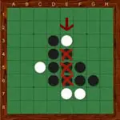

# ohhello
## Spec
- [ ] add basic game
  - two players can start a game
  - the game initializes with a 8x8 board
  - the game initializes with 4 disks (2 from each player)
  - the initial disks are placed in the middle of the board in alternating colors
  - players place disks until all squares are full *or* players have no valid moves left
  - when the game ends, the player with a majority of disks on the board wins
- [ ] deploy game

### Nice to haves
- [ ] persist game state locally so that a player may continue where they left off
- [ ] add multiplayer
- [ ] add timer
- [ ] log each player's moves
- [ ] review previous games

### Game rules
- Players: 2
- Components: 64 disks. Each disk has two sides: black or white
- Each player gets 32 disks and picks a color
- The goal of the game is to get a majority of the disks in your color on the board by the end of the game
- Black and white alternate turns placing disks on the board until:
  - One player cannot make a valid move to outflank the opponent--they forfeit their turn and the opponent keeps going
  - Both players have no valid moves
- When it is no longer possible for either player to move, the game is over

#### Valid moves and outflanking your opponent
- A move is made by placing a disk of the player's color on the board in a position that "out-flanks" one or more of the opponent's disks
- A disk or row of disck is outflanked when it is surrounded *at the ends* by disks of the opposite color
- A disk may outflank any number of disks in one or more rows in any direction (horizontal, vertical, diagonal)
- All disks which are outflanked will be flipped to the current player's color
- For example: a white disk is being placed on the board that creates a straight line made up of a white disk at either end and **only** black pieces in between

